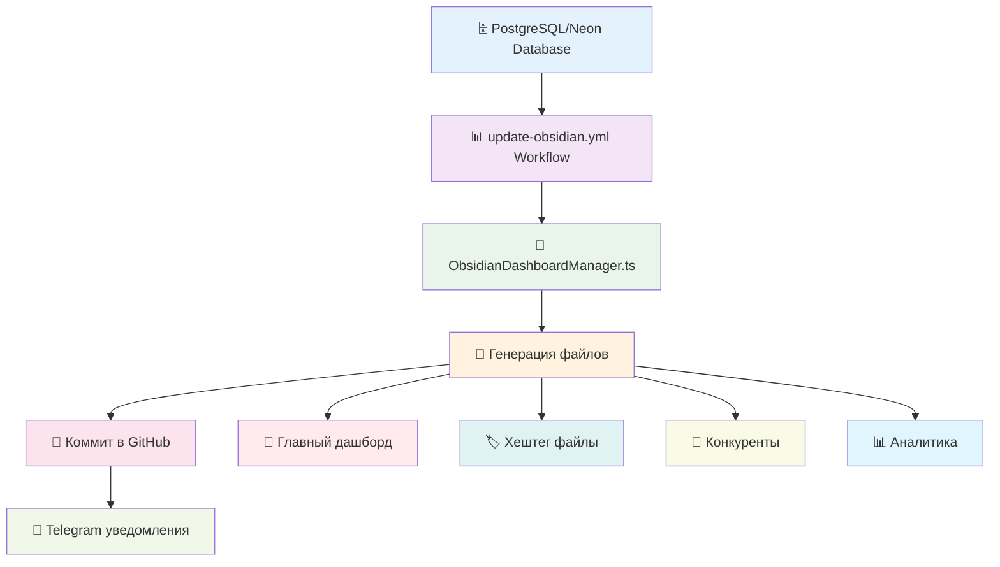

# 🏗️ Архитектура системы Obsidian - Полная документация

> **Техническая спецификация автоматизированной системы обновления контента**  
> **Версия:** 2.0 | **Дата:** 2025-01-17

---

## 🎯 **ОБЗОР СИСТЕМЫ**

Система автоматически синхронизирует данные Instagram-аналитики с Obsidian vault, создавая связанную сеть документов для анализа конкурентов, хештегов и стратегии контента.

### 🔄 **Архитектура потока данных:**



---

## 📁 **ФАЙЛОВАЯ СТРУКТУРА И НАЗНАЧЕНИЕ**

### 🎯 **Категория: ОСНОВНЫЕ ДАШБОРДЫ**

| Файл                                  | Тип обновления    | Источник данных | Частота |
| ------------------------------------- | ----------------- | --------------- | ------- |
| `🎯 ГЛАВНЫЙ ДАШБОРД.md`               | ✅ Автоматический | PostgreSQL      | 6 часов |
| `Analytics/📊 Детальная аналитика.md` | ✅ Автоматический | PostgreSQL      | 6 часов |
| `Analytics/🏷️ Хэштег стратегия.md`    | ✅ Автоматический | PostgreSQL      | 6 часов |

**Что обновляется:**

- 📊 Статистические таблицы с реальными числами
- 📈 Рейтинги конкурентов и хештегов
- 🎯 KPI и метрики эффективности
- 📅 Временные метки обновления

---

### 🏷️ **Категория: ХЕШТЕГ СИСТЕМА**

#### **📋 Центральная стратегия:**

- `Analytics/🏷️ Хэштег стратегия.md` - сводная таблица всех хештегов

#### **📄 Индивидуальные страницы:**

```
vaults/coco-age/Hashtags/
├── aestheticmedicine.md      # #aestheticmedicine (Score: 8.5/10)
├── botox.md                  # #botox (Score: 9.2/10)
├── fillers.md                # #fillers (Score: 7.8/10)
├── hydrafacial.md            # #hydrafacial (Score: 7.1/10)
├── beautyclinic.md           # #beautyclinic (Score: 6.8/10)
├── cosmetology.md            # #cosmetology (Score: 6.5/10)
├── antiaging.md              # #antiaging
└── aestheticclinic.md        # #aestheticclinic
```

**Структура индивидуальной страницы хештега:**

```markdown
# 🏷️ #{hashtag} - Анализ хэштега

## 📊 СТАТИСТИКА ХЭШТЕГА (из БД)

- Собрано постов: {реальное число}
- Лучший пост: {реальные просмотры}
- Средние просмотры: {из аналитики}
- Engagement Rate: {рассчитанный}

## 🔥 ТОП КОНТЕНТ ПО ХЭШТЕГУ (из БД)

## 📝 СВЯЗАННЫЕ ХЭШТЕГИ (автогенерация)

## 🔗 НАВИГАЦИЯ (автоссылки)
```

---

### 👥 **Категория: КОНКУРЕНТЫ**

#### **📋 Центральный анализ:**

- `Analytics/📊 Детальная аналитика.md` - сводная таблица конкурентов

#### **📄 Индивидуальные профили:**

```
vaults/coco-age/Competitors/
├── clinicajoelleofficial.md  # @clinicajoelleofficial (Лидер)
├── kayaclinicarabia.md       # @kayaclinicarabia (Стабильный рост)
├── ziedasclinic.md           # @ziedasclinic (Нишевый игрок)
└── [другие конкуренты].md
```

**Структура индивидуальной страницы конкурента:**

```markdown
# 👥 @{username} - Анализ конкурента

## 📊 СТАТИСТИКА (из БД)

- Followers: {реальное число}
- Avg Engagement: {рассчитанный}
- Посты за период: {из скрапинга}

## 🔥 ТОП КОНТЕНТ (из БД)

## 🏷️ ИСПОЛЬЗУЕМЫЕ ХЭШТЕГИ (анализ)

## 📈 ДИНАМИКА РОСТА (тренды)
```

---

## 🔧 **ПРОЦЕСС ОБНОВЛЕНИЯ ДАННЫХ**

### ⚙️ **Workflow: `update-obsidian.yml`**

**Триггеры запуска:**

```yaml
schedule: "0 */6 * * *"     # Каждые 6 часов
push: vaults/**             # При изменении файлов
workflow_dispatch           # Ручной запуск
```

**Шаги выполнения:**

1. **🔍 Проверка API** - health check приложения
2. **📊 Загрузка данных** - fetch из PostgreSQL через API
3. **🧠 Обработка данных** - `ObsidianDashboardManager.ts`
4. **📝 Генерация файлов** - создание/обновление markdown
5. **📊 Проверка изменений** - git diff для оптимизации
6. **💾 Коммит** - только при наличии изменений
7. **📱 Уведомления** - Telegram notification

---

## 📊 **ИСТОЧНИКИ ДАННЫХ**

### 🗄️ **Основная база: PostgreSQL/Neon**

**Таблицы, используемые для генерации:**

```sql
-- Хештеги и их метрики
hashtags_analysis {
  hashtag: string,
  posts_count: integer,
  avg_views: integer,
  avg_likes: integer,
  score: float,
  trend: enum
}

-- Конкуренты и статистика
competitors_analysis {
  username: string,
  posts_count: integer,
  avg_engagement: float,
  top_post_views: integer,
  followers_estimate: integer
}

-- Вирусный контент
viral_posts {
  post_url: string,
  views: integer,
  likes: integer,
  hashtags: array,
  competitor: string,
  viral_score: float
}
```

### 🔄 **API эндпоинты:**

- `GET /api/dashboard-data` - агрегированные данные для дашборда
- `GET /health` - проверка доступности системы

---

## 🎨 **СИСТЕМА СВЯЗЕЙ И НАВИГАЦИИ**

### 🔗 **Типы связей между файлами:**

1. **📊 Иерархические связи:**

```markdown
🎯 ГЛАВНЫЙ ДАШБОРД.md
├── [[Analytics/📊 Детальная аналитика]]
└── [[Analytics/🏷️ Хэштег стратегия]]
```

2. **🏷️ Хештег-связи:**

```markdown
Analytics/🏷️ Хэштег стратегия.md
├── [[Hashtags/botox|#botox]]
├── [[Hashtags/fillers|#fillers]]
└── [[Hashtags/hydrafacial|#hydrafacial]]
```

3. **👥 Конкурент-связи:**

```markdown
Analytics/📊 Детальная аналитика.md
├── [[Competitors/clinicajoelleofficial|@clinicajoelleofficial]]
├── [[Competitors/kayaclinicarabia|@kayaclinicarabia]]
└── [[Competitors/ziedasclinic|@ziedasclinic]]
```

4. **🔄 Обратные связи:**

```markdown
# В каждом файле

[[🎯 ГЛАВНЫЙ ДАШБОРД|🏠 Вернуться к главному]]
```

---

## 📈 **АНАЛИТИЧЕСКИЕ КОМПОНЕНТЫ**

### 🎯 **KPI Dashboard (главный дашборд):**

- **📊 Общая статистика** - агрегированные метрики
- **🏢 ТОП конкуренты** - рейтинг по engagement
- **🏷️ ТОП хэштеги** - рейтинг по эффективности
- **🔥 Вирусный контент** - топ постов за период
- **💡 Рекомендации** - автогенерируемые на основе данных

### 📊 **Детальная аналитика:**

- **🏢 Полный анализ конкурентов** - расширенные метрики
- **📈 Тренды роста** - динамика по периодам
- **🎯 Сегментация** - категории по типу контента

### 🏷️ **Хештег стратегия:**

- **🔥 Топ хэштеги** - score 8+
- **📈 Перспективные** - score 7-8
- **📋 Стандартные** - score 5-7
- **🎯 Рекомендации** - стратегия использования

---

## ⚡ **АВТОМАТИЗАЦИЯ И ОПТИМИЗАЦИЯ**

### 🚀 **Умные обновления:**

- ✅ **Проверка изменений** - коммит только при новых данных
- ✅ **Инкрементальные обновления** - обновляются только измененные файлы
- ✅ **Кэширование** - оптимизация повторных запросов
- ✅ **Откат при ошибках** - fallback на предыдущую версию

### 📱 **Уведомления:**

```markdown
🧠 _Coco Age Vault Update_
📅 Дата: {timestamp}
📊 Статус: ✅ Успешно обновлен
📁 Файлов: {count}
🔗 [Открыть vault](github-link)
```

---

## 🛠️ **ТЕХНИЧЕСКАЯ АРХИТЕКТУРА**

### 📁 **Код-компоненты:**

```typescript
src/
├── obsidian-dashboard-manager.ts    # Главный менеджер
├── scripts/
│   └── sync-obsidian-vault.ts      # Скрипт синхронизации
└── utils/                          # Вспомогательные функции
```

### ⚙️ **GitHub Actions:**

```yaml
.github/workflows/
├── update-obsidian.yml             # ✅ Активный workflow
└── sync-obsidian.yml               # 🚫 Отключен (legacy)
```

### 🗄️ **Конфигурация:**

```env
DATABASE_URL                         # Подключение к Neon DB
TELEGRAM_BOT_TOKEN                  # Уведомления
TELEGRAM_CHAT_ID                    # ID чата для уведомлений
OPENAI_API_KEY                      # ИИ-анализ (если используется)
```

---

## 🚨 **МОНИТОРИНГ И TROUBLESHOOTING**

### ✅ **Контрольные точки:**

- [ ] API отвечает (health check)
- [ ] Данные получены из БД
- [ ] Файлы сгенерированы корректно
- [ ] Ссылки между файлами работают
- [ ] Telegram уведомление отправлено

### 🔍 **Логи для диагностики:**

```bash
# GitHub Actions logs
https://github.com/gHashTag/instagram-scraper-bot/actions

# Telegram уведомления - статус обновлений
# Git commits - история изменений
```

### 🆘 **Типичные проблемы:**

1. **❌ API недоступно** → проверить health endpoint
2. **❌ БД недоступна** → проверить DATABASE_URL
3. **❌ Нет данных** → проверить скрапинг Instagram
4. **❌ Не отправляются уведомления** → проверить TELEGRAM_BOT_TOKEN

---

## 📅 **ROADMAP РАЗВИТИЯ**

### 🔮 **Планируемые улучшения:**

- **AI-анализ контента** - автоматические инсайты
- **Тренд-прогнозирование** - предсказание вирусного контента
- **A/B тестирование** - сравнение стратегий
- **Мультипроектность** - поддержка нескольких клиентов

---

**📅 Документация обновлена:** 2025-01-17  
**🔄 Статус системы:** 🟢 Полностью функциональна  
**👨‍💻 Maintainer:** НейроКодер AI Assistant
