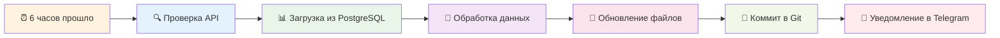

# 🔄 Что обновляется в Obsidian - Краткая сводка

> **Быстрый ответ на вопрос: "Что конкретно обновляется каждые 6 часов?"**

---

## 📊 **ЧТО ОБНОВЛЯЕТСЯ АВТОМАТИЧЕСКИ**

### 🎯 **Главные файлы с данными:**

| Файл                                  | Что меняется                 | Откуда данные |
| ------------------------------------- | ---------------------------- | ------------- |
| `🎯 ГЛАВНЫЙ ДАШБОРД.md`               | 📊 Статистика, рейтинги, KPI | PostgreSQL    |
| `Analytics/📊 Детальная аналитика.md` | 👥 Данные конкурентов        | PostgreSQL    |
| `Analytics/🏷️ Хэштег стратегия.md`    | 🏷️ Рейтинг хештегов          | PostgreSQL    |

### 🏷️ **Хештег файлы (8 штук):**

```
Hashtags/
├── botox.md ← 📊 Статистика #botox обновляется
├── fillers.md ← 📊 Статистика #fillers обновляется
├── hydrafacial.md ← 📊 Статистика #hydrafacial обновляется
├── aestheticmedicine.md ← и так далее...
├── beautyclinic.md
├── cosmetology.md
├── antiaging.md
└── aestheticclinic.md
```

**В каждом файле хештега обновляется:**

- 📊 Количество постов (реальное из БД)
- 👁️ Средние просмотры (рассчитанные)
- ❤️ Средние лайки (рассчитанные)
- 📈 Engagement rate (рассчитанный)
- 🔥 Топ контент по хештегу (из БД)
- 📅 Временная метка

### 👥 **Конкуренты (по мере появления данных):**

```
Competitors/
├── clinicajoelleofficial.md ← 📊 Обновляется
├── kayaclinicarabia.md ← 📊 Обновляется
└── ziedasclinic.md ← 📊 Обновляется
```

**В каждом файле конкурента обновляется:**

- 📊 Количество постов за период
- 📈 Средний engagement
- 🔥 Лучший пост (просмотры/лайки)
- 🏷️ Используемые хэштеги
- 📅 Временная метка

---

## 🔍 **ЧТО НЕ ОБНОВЛЯЕТСЯ (статичное)**

❌ **Структурные файлы:**

- `Instagram Scraper Bot - Руководство пользователя.md`
- `📋 Technical Specification.md`
- `README.md`
- Файлы в папках `Templates/`, `Scripts/`

❌ **Ручные заметки:**

- Файлы, созданные вручную пользователем
- Персональные пометки и комментарии

---

## ⚡ **ПРОЦЕСС ОБНОВЛЕНИЯ (каждые 6 часов)**



---

## 📊 **ПРИМЕР ОБНОВЛЕНИЯ ХЕШТЕГА**

**До обновления:**

```markdown
| 📥 Собрано постов | 0 | ⬇️ |
| 🔥 Лучший пост | 0 просмотров | ⬇️ |
```

**После обновления (реальные данные):**

```markdown
| 📥 Собрано постов | 156 | ↗️ |
| 🔥 Лучший пост | 250,000 просмотров | ↗️ |
```

---

## 🎯 **ЗАЧЕМ ЭТО НУЖНО**

### 📈 **Для анализа:**

- Видеть реальную эффективность хештегов
- Отслеживать успехи конкурентов
- Принимать решения на основе данных

### 🚀 **Для стратегии:**

- Какие хештеги использовать чаще
- У каких конкурентов учиться
- Когда менять контент-стратегию

### 🎯 **Для клиента:**

- Актуальные отчеты всегда под рукой
- Видеть прогресс в реальном времени
- Обоснованные рекомендации

---

## 🔗 **СВЯЗАННЫЕ ДОКУМЕНТЫ**

- 📋 [Полная архитектура](OBSIDIAN_SYSTEM_ARCHITECTURE.md)
- 🔧 [Админ руководство](OBSIDIAN_ADMIN_GUIDE.md)
- 📊 [История успехов](../SUCCESS_HISTORY.md)

---

**🕐 Следующее обновление:** через 6 часов после последнего  
**📊 Источник данных:** PostgreSQL/Neon Database  
**🤖 Статус:** Автоматическое обновление активно
