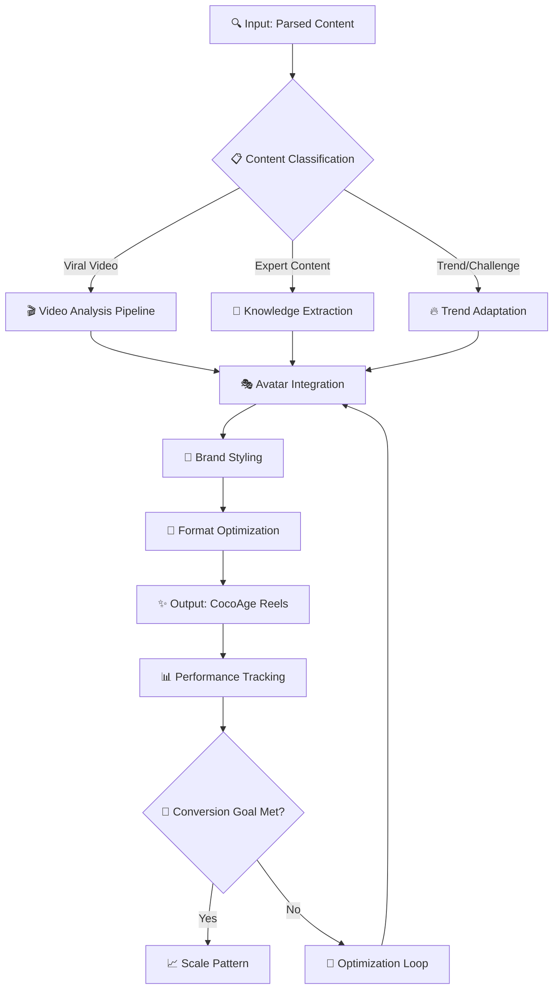

# 📊 Conv.Rules - Content Factory Conversion Framework

## 🎯 Цель системы Conv.Rules

Автоматизированная система преобразования сырого контента конкурентов в оригинальный высококачественный контент CocoAge с максимальным вирусным потенциалом и конверсией в продажи.

---

## 🔄 Основной Алгоритм Преобразования

### Input → Processing → Output Framework



---

## 🧠 Классификационная Система (Content Classification)

### 📋 Тип 1: AI-Генерируемый Контент

**Условия для AI-генерации:**

- ✅ Экспертный контент с говорящей головой
- ✅ Инфографика и сравнения
- ✅ Образовательные ролики
- ✅ До/После трансформации (схематичные)
- ✅ FAQ и вопрос-ответ

**Алгоритм обработки:**

```
Источник → Транскрипция → Адаптация под CocoAge → Аватар → Публикация
```

### 🎬 Тип 2: Требует Ручной Съемки

**Условия для ручной работы:**

- ❌ Реальные процедуры в клинике
- ❌ Живые реакции клиентов
- ❌ Танцевальные тренды
- ❌ Сложные визуальные эффекты
- ❌ Интерактивное взаимодействие

**Алгоритм обработки:**

```
Источник → Ссылка команде → Концепт → Съемка → Монтаж → Публикация
```

---

## ⚙️ Детальные Правила Конверсии

### 🔍 Этап 1: Анализ и Классификация

#### 1.1 Парсинг Фильтры

```yaml
parsing_criteria:
  date: <= 14 days
  views: >= 50,000
  engagement_rate: >= 2%
  content_language: [ru, en, ar]
  niche_relevance: aesthetics_medicine

quality_filters:
  video_quality: >= 720p
  audio_clarity: good
  content_completeness: full_video
  copyright_safe: verified
```

#### 1.2 AI Classification Prompt

```
SYSTEM: Ты эксперт по контенту эстетической медицины.
Анализируй видео и определи:

1. Тип контента: [expert/procedure/trend/educational]
2. Возможность AI-генерации: [yes/no/partial]
3. Ключевые элементы: [hook/main_point/cta]
4. Целевая аудитория: [potential_clients/professionals/general]
5. Эмоциональная направленность: [trust/excitement/education/transformation]

INPUT: {video_transcript + metadata}
OUTPUT: Structured JSON с рекомендациями
```

### 🎨 Этап 2: Адаптация под CocoAge Brand

#### 2.1 Brand Conversion Rules

```yaml
cocoage_adaptation:
  voice_tone:
    - professional_yet_approachable
    - confident_expert
    - empathetic_understanding

  key_messages:
    - safety_first
    - natural_beauty_enhancement
    - dubai_premium_quality
    - personalized_approach

  visual_style:
    - minimalist_luxury
    - warm_gold_accents
    - clean_medical_aesthetic
    - dubai_sophistication

  call_to_action:
    - consultation_booking
    - follow_for_tips
    - dm_for_questions
    - visit_clinic
```

#### 2.2 Content Adaptation Templates

**Template 1: Expert Tips**

```
Hook: "❓ {trending_question_from_source}"
Body: "{adapted_expert_answer_with_cocoage_perspective}"
CTA: "🔗 Запишись на консультацию в CocoAge Dubai"

Avatar_Style: Confident expert in medical setting
Duration: 15-30 seconds
Background: CocoAge clinic interior
```

**Template 2: Myth Busting**

```
Hook: "🚫 МИФ: {common_misconception_from_source}"
Body: "✅ ПРАВДА: {corrected_info_with_cocoage_expertise}"
CTA: "💬 Больше фактов в DM"

Avatar_Style: Authoritative but friendly
Duration: 20-40 seconds
Background: Medical consultation room
```

**Template 3: Transformation Stories**

```
Hook: "🌟 Результат как у {celebrity/influencer_from_source}"
Body: "Как в CocoAge мы добиваемся таких результатов..."
CTA: "📞 Твоя трансформация начинается с консультации"

Avatar_Style: Inspiring and professional
Duration: 30-60 seconds
Background: Before/after gallery
```

### 🤖 Этап 3: AI Avatar Integration

#### 3.1 Avatar Personality Matrix

```yaml
avatar_personalities:
  dr_expert:
    voice: professional, authoritative
    gestures: minimal, precise
    background: medical office
    use_for: [educational, myth_busting, procedures]

  consultant_friendly:
    voice: warm, approachable
    gestures: open, welcoming
    background: consultation room
    use_for: [tips, advice, client_stories]

  presenter_confident:
    voice: engaging, dynamic
    gestures: expressive, enthusiastic
    background: clinic lobby
    use_for: [trends, comparisons, promotions]
```

#### 3.2 Lip-sync Optimization Rules

```yaml
lipsync_parameters:
  language_specific:
    russian:
      speed: 0.9x
      emphasis: consonants
      mouth_shape: natural_ru
    english:
      speed: 1.0x
      emphasis: vowels
      mouth_shape: natural_en
    arabic:
      speed: 0.85x
      emphasis: gutturals
      mouth_shape: natural_ar

  content_specific:
    medical_terms: slow_precise
    emotional_content: expressive
    technical_explanation: measured
```

### 🎬 Этап 4: Видеопроизводство

#### 4.1 Automated Video Generation Pipeline

```yaml
video_pipeline:
  script_preparation:
    - adapt_source_content
    - add_brand_messaging
    - optimize_for_avatar
    - add_cta_integration

  avatar_recording:
    - select_personality
    - generate_voice
    - create_video
    - apply_lipsync

  post_production:
    - add_brand_overlay
    - insert_clinic_footage
    - apply_color_grading
    - add_subtitles

  final_optimization:
    - mobile_format
    - engagement_hooks
    - trending_audio
    - hashtag_integration
```

#### 4.2 Visual Enhancement Rules

```yaml
visual_enhancements:
  brand_elements:
    logo_placement: bottom_right, 15% opacity
    color_scheme: gold_accents, medical_white
    typography: modern_sans, readable

  engagement_boosters:
    captions: large, contrasting, emojis
    progress_bars: for_longer_content
    call_out_boxes: for_key_points
    before_after: split_screen_when_relevant

  mobile_optimization:
    aspect_ratio: 9:16
    text_size: mobile_readable
    loading_time: < 3 seconds
    file_size: optimized
```

---

## 📈 Конверсионная Оптимизация

### 🎯 KPI Tracking System

#### Входные Метрики (Source Performance)

```yaml
source_metrics:
  viral_coefficient: views/followers_ratio
  engagement_rate: (likes+comments+shares)/views
  completion_rate: avg_watch_time/video_length
  save_rate: saves/views
  share_velocity: shares_per_hour_first_24h
```

#### Выходные Метрики (CocoAge Performance)

```yaml
output_metrics:
  brand_awareness:
    reach: unique_accounts_reached
    brand_mentions: tagged_posts
    profile_visits: clicks_to_profile

  engagement_quality:
    comment_sentiment: positive_ratio
    dm_inquiries: consultation_requests
    story_interactions: polls_responses

  conversion_funnel:
    link_clicks: bio_link_traffic
    consultation_bookings: actual_appointments
    client_acquisition: new_patients
    revenue_attribution: tracked_sales
```

### 🔄 Optimization Loops

#### Алгоритм A/B Testing

```yaml
ab_testing_framework:
  variables_to_test:
    hooks: [question, statement, statistic, story]
    avatar_style: [professional, friendly, confident]
    cta_type: [book_now, learn_more, dm_us, follow]
    video_length: [15s, 30s, 45s, 60s]

  testing_methodology:
    sample_size: minimum_100_views_per_variant
    testing_period: 48_hours
    significance_level: 95%

  optimization_triggers:
    performance_below_baseline: 20%
    no_conversions_in: 24_hours
    negative_sentiment: >10

  adaptive_learning:
    successful_patterns: add_to_template_library
    failed_experiments: add_to_exclusion_list
    trending_elements: boost_in_algorithm
```

---

## 🚦 Quality Control Gates

### ✅ Pre-Publication Checklist

#### Brand Compliance

- [ ] **Message Alignment:** Content aligns with CocoAge values
- [ ] **Medical Accuracy:** All medical claims are verified
- [ ] **Legal Compliance:** No copyright violations
- [ ] **Cultural Sensitivity:** Appropriate for Dubai market

#### Technical Quality

- [ ] **Video Quality:** HD resolution, stable footage
- [ ] **Audio Quality:** Clear voice, no background noise
- [ ] **Lip Sync:** Perfect synchronization achieved
- [ ] **Mobile Optimization:** Displays correctly on mobile

#### Engagement Optimization

- [ ] **Hook Strength:** Compelling first 3 seconds
- [ ] **Value Delivery:** Clear benefit to viewer
- [ ] **CTA Clarity:** Specific action requested
- [ ] **Hashtag Strategy:** Relevant and trending tags

### 🚨 Automatic Rejection Criteria

```yaml
auto_reject_rules:
  technical:
    video_quality: < 720p
    audio_issues: distortion_or_noise
    lipsync_delay: > 100ms

  content:
    medical_misinformation: any_detected
    competitor_branding: visible_logos
    inappropriate_content: flagged_by_ai

  performance:
    negative_sentiment: > 30%
    copyright_claims: any_detected
    community_guidelines: violations
```

---

## 🎛️ Manual Override Protocols

### 👨‍⚚️ Human Review Triggers

```yaml
human_review_required:
  high_stakes_content:
    - medical_procedures_explanation
    - pricing_information
    - promotional_offers

  edge_cases:
    - cultural_references_unclear
    - trending_topic_sensitivity
    - competitor_response_needed

  quality_concerns:
    - ai_confidence_score < 85%
    - multiple_optimization_failures
    - unusual_engagement_patterns
```

### 🎚️ Manual Control Dashboard

```yaml
manual_controls:
  content_adjustment:
    script_editing: real_time_modification
    avatar_personality: switch_mid_production
    visual_elements: add_remove_elements

  publishing_control:
    schedule_override: manual_timing
    platform_selection: custom_distribution
    audience_targeting: refined_demographics

  crisis_management:
    content_pause: stop_all_publishing
    rapid_response: priority_content_creation
    damage_control: negative_feedback_management
```

---

## 📊 Performance Analytics Dashboard

### 📈 Real-time Monitoring

```yaml
dashboard_metrics:
  production_health:
    content_generation_rate: reels_per_hour
    system_uptime: availability_percentage
    error_rate: failed_generations_ratio

  content_performance:
    live_engagement: real_time_interactions
    trending_score: algorithm_boost_factor
    conversion_rate: inquiries_per_view

  business_impact:
    lead_generation: qualified_inquiries
    appointment_booking: conversion_to_consultation
    revenue_attribution: tracked_patient_value
```

### 🎯 Predictive Analytics

```yaml
predictive_models:
  viral_potential:
    features: [hook_type, trending_topic, optimal_timing]
    prediction: views_in_first_24h
    accuracy_target: 80%

  conversion_likelihood:
    features: [audience_demographics, content_type, cta_placement]
    prediction: inquiry_probability
    optimization: automatic_cta_adjustment

  trend_forecasting:
    data_sources: [competitor_analysis, social_listening, search_trends]
    prediction: upcoming_viral_topics
    lead_time: 7_days_advance_notice
```

---

## 🔧 System Configuration

### ⚙️ API Integration Settings

```yaml
api_configurations:
  heygen:
    quality_preset: ultra_hd
    processing_priority: high
    language_models: [ru, en, ar]

  runwayml:
    generation_model: gen2_premium
    style_consistency: enabled
    brand_training: cocoage_dataset

  instagram_api:
    posting_frequency: optimal_timing
    hashtag_research: auto_trending
    audience_insights: enabled

  telegram_bot:
    admin_controls: full_access
    notification_levels: critical_only
    command_interface: intuitive_ui
```

### 🔐 Security & Compliance

```yaml
security_measures:
  content_protection:
    watermarking: invisible_brand_signature
    copyright_detection: automatic_scanning
    content_backup: redundant_storage

  data_privacy:
    gdpr_compliance: enabled
    data_encryption: end_to_end
    access_controls: role_based

  business_continuity:
    disaster_recovery: 4_hour_rto
    data_backup: daily_automated
    system_monitoring: 24_7_alerts
```

---

_Документ создан: {{date}}_  
_Версия: 1.0_  
_Ответственный: Дмитрий Васильев (Technical Lead)_  
_Утверждение: Наталья Ткачева (Project Manager)_
