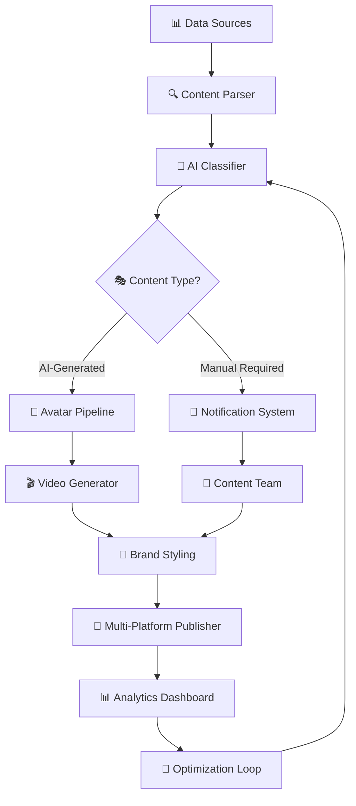

# 📋 Technical Specification - CocoAge AI Content Factory

## 🎯 Цель и Задачи Проекта

### Основная Цель

Создание полностью автоматизированного AI-контент-завода для производства высококачественного видеоконтента Instagram Reels в нише эстетической медицины с производительностью 1-4 ролика в день.

### Ключевые Задачи

1. **Автоматизация поиска и отбора контента** через парсинг конкурентов
2. **Создание AI-аватара** в фирменном стиле CocoAge Dubai
3. **Генерация оригинального контента** с использованием нейросетей
4. **Автоматическая публикация** в социальных сетях
5. **Интеграция с воронками продаж** и CRM-системами

---

## 🔧 Техническая Архитектура

### 🏗️ Системная Архитектура


```mermaid
graph TB
    A[📊 Data Sources] --> B[🔍 Content Parser]
    B --> C[🧠 AI Classifier]
    C --> D{🎭 Content Type?}

    D -->|AI-Generated| E[🤖 Avatar Pipeline]
    D -->|Manual Required| F[📱 Notification System]

    E --> G[🎬 Video Generator]
    G --> H[🎨 Brand Styling]
    H --> I[📱 Multi-Platform Publisher]

    I --> J[📊 Analytics Dashboard]
    J --> K[🔄 Optimization Loop]
    K --> C

    F --> L[👥 Content Team]
    L --> H
```

### 📊 Data Flow Architecture

```yaml
data_pipeline:
  input_stage:
    - competitor_parsing
    - hashtag_monitoring
    - trend_detection

  processing_stage:
    - content_classification
    - script_adaptation
    - brand_alignment

  generation_stage:
    - avatar_creation
    - video_synthesis
    - audio_generation

  output_stage:
    - platform_publishing
    - performance_tracking
    - feedback_loop
```

---

## 🔍 Модуль 1: Автопарсинг Контента

### 1.1 Источники Данных

#### Целевые Аккаунты Конкурентов:

```yaml
competitor_accounts:
  primary_targets:
    - clinicajoelleofficial: 658k_followers
    - lips_for_kiss: 811k_followers
    - med_yu_med: 512k_followers

  secondary_targets:
    - kayaclinicarabia: 54k_followers
    - ziedasclinic: 23.7k_followers
    - milena_aesthetic_clinic: 35.3k_followers
    - graise_aesthetics: 3.4k_followers
```

#### Ключевые Хэштеги:

```yaml
target_hashtags:
  medical_procedures:
    - "#aestheticmedicine"
    - "#cosmetology"
    - "#botox"
    - "#fillers"

  treatments:
    - "#hydrafacial"
    - "#prpfacial"
    - "#rfmicroneedling"
    - "#skinrejuvenation"

  business_terms:
    - "#aestheticclinic"
    - "#beautyclinic"
    - "#facialtreatment"
    - "#aesthetictreatment"
```

### 1.2 Критерии Фильтрации

#### Обязательные Параметры:

```yaml
filtering_criteria:
  temporal:
    publication_date: <= 14_days
    trending_window: 24-48_hours_peak

  engagement:
    minimum_views: 50000
    engagement_rate: >= 2%
    completion_rate: >= 70%

  content_quality:
    video_resolution: >= 720p
    audio_quality: clear_speech
    duration: 15-90_seconds

  relevance:
    niche_alignment: aesthetics_medicine
    language: [russian, english, arabic]
    content_type: [educational, promotional, transformation]
```

#### Автоматические Исключения:

```yaml
exclusion_filters:
  copyright_issues:
    - copyrighted_music
    - branded_content_third_party
    - stock_footage_watermarks

  content_restrictions:
    - explicit_medical_procedures
    - before_after_real_patients
    - competitor_branding_visible

  quality_issues:
    - poor_audio_quality
    - low_resolution
    - technical_errors
```

### 1.3 Техническая Реализация Парсинга

#### API и Инструменты:

```yaml
parsing_technology:
  primary_tools:
    - apify_instagram_scraper
    - instagram_graph_api
    - python_instaloader

  data_storage:
    - google_sheets_api
    - airtable_database
    - postgresql_backup

  processing_pipeline:
    - python_pandas
    - opencv_video_analysis
    - speech_to_text_whisper
```

#### Структура Данных:

```yaml
content_record_schema:
  metadata:
    - source_url: string
    - publication_date: datetime
    - views_count: integer
    - engagement_rate: float
    - hashtags: array

  content_analysis:
    - transcript: text
    - duration: seconds
    - content_type: enum
    - ai_generatable: boolean
    - trending_score: float

  processing_status:
    - classification: enum
    - priority_score: integer
    - processing_stage: enum
    - final_url: string
```

---

## 🤖 Модуль 2: AI-Аватар и Генерация Контента

### 2.1 Спецификация AI-Аватара

#### Визуальные Характеристики:

```yaml
avatar_specifications:
  appearance:
    gender: female
    age_range: 28-35_years
    ethnicity: middle_eastern_european_mix
    style: professional_medical_aesthetic

  personality_traits:
    voice_tone: confident_yet_approachable
    expertise_level: medical_professional
    communication_style: educational_engaging
    cultural_adaptation: dubai_international

  technical_parameters:
    resolution: 4k_ultra_hd
    frame_rate: 30_fps
    aspect_ratio: 9:16_mobile
    background: customizable_medical_settings
```

#### Голосовая Модель:

```yaml
voice_characteristics:
  languages:
    primary: russian_native
    secondary: english_fluent
    tertiary: arabic_basic

  vocal_properties:
    pitch: medium_warm
    pace: measured_professional
    emotion: empathetic_confident
    accent: neutral_international

  technical_specs:
    sample_rate: 48khz
    bit_depth: 24bit
    noise_floor: <-60db
    dynamic_range: professional_broadcast
```

### 2.2 Lip-Sync Technology

#### Синхронизация Parameters:

```yaml
lipsync_configuration:
  accuracy_targets:
    visual_sync: <50ms_delay
    audio_match: 99%_phoneme_accuracy
    natural_movement: human_like_transitions

  language_optimization:
    russian_phonemes: specialized_model
    english_phonemes: international_standard
    arabic_phonemes: custom_adaptation

  performance_specs:
    processing_time: <2min_per_minute_video
    gpu_requirements: nvidia_rtx_4090_minimum
    memory_usage: <8gb_vram
```

### 2.3 Content Generation Pipeline

#### Script Adaptation Process:

```yaml
content_adaptation:
  input_processing:
    - source_transcript_extraction
    - key_message_identification
    - brand_alignment_check

  adaptation_rules:
    - maintain_core_value_proposition
    - inject_cocoage_expertise
    - add_dubai_market_specifics
    - include_call_to_action

  output_optimization:
    - mobile_format_optimization
    - engagement_hook_enhancement
    - trending_element_integration
    - subtitle_generation
```

#### Video Generation Workflow:

```yaml
video_production_pipeline:
  pre_production:
    - script_finalization
    - avatar_personality_selection
    - background_environment_choice
    - brand_element_preparation

  production:
    - avatar_video_generation
    - voice_synthesis
    - lip_sync_application
    - initial_rendering

  post_production:
    - brand_overlay_addition
    - subtitle_integration
    - music_background_mixing
    - final_quality_check

  optimization:
    - mobile_device_testing
    - compression_optimization
    - platform_specific_formatting
    - metadata_preparation
```

---

## 📱 Модуль 3: Автопостинг и Распространение

### 3.1 Платформы и Интеграции

#### Целевые Социальные Сети:

```yaml
publishing_platforms:
  instagram:
    content_types: [reels, stories, posts]
    api: instagram_graph_api
    posting_schedule: optimal_timing_algorithm
    hashtag_strategy: trending_medical_hashtags

  tiktok:
    content_types: [videos, stories]
    api: tiktok_business_api
    optimization: algorithm_friendly_format
    targeting: dubai_aesthetic_audience

  youtube:
    content_types: [shorts, videos]
    api: youtube_data_api
    seo_optimization: medical_keywords
    playlist_organization: treatment_categories
```

#### Автоматизация Publishing:

```yaml
publishing_automation:
  scheduling_logic:
    - optimal_time_prediction
    - audience_activity_analysis
    - platform_algorithm_optimization
    - content_type_scheduling

  content_adaptation:
    - platform_specific_formatting
    - aspect_ratio_optimization
    - caption_customization
    - hashtag_strategy_per_platform

  monitoring_system:
    - real_time_performance_tracking
    - engagement_rate_monitoring
    - error_detection_alerts
    - manual_override_capabilities
```

### 3.2 Панель Управления Telegram

#### Bot Functionality:

```yaml
telegram_bot_features:
  content_management:
    - daily_generation_review
    - manual_approval_process
    - emergency_content_pause
    - priority_content_pushing

  monitoring_dashboard:
    - real_time_metrics_display
    - system_health_indicators
    - content_performance_summary
    - alert_notification_system

  manual_controls:
    - custom_content_requests
    - scheduling_modifications
    - quality_issue_reporting
    - team_communication_hub
```

#### User Interface Design:

```yaml
bot_interface_structure:
  main_menu:
    buttons: [📊 Dashboard, 🎬 Content, ⚙️ Settings, 📞 Support]

  dashboard_view:
    - today_statistics
    - trending_content_performance
    - system_status_indicators
    - quick_action_buttons

  content_management:
    - pending_approval_queue
    - scheduled_content_calendar
    - manual_upload_interface
    - bulk_operations_panel
```

---

## 📊 Модуль 4: Аналитика и Оптимизация

### 4.1 Метрики и KPI Tracking

#### Performance Metrics:

```yaml
tracking_metrics:
  content_performance:
    views: total_unique_reach
    engagement: likes_comments_shares_saves
    completion_rate: average_watch_time
    click_through: profile_visits_link_clicks

  business_metrics:
    lead_generation: dm_inquiries_consultation_requests
    conversion_rate: appointment_bookings
    customer_acquisition: new_patient_registrations
    revenue_attribution: tracked_sales_value

  system_performance:
    generation_speed: content_creation_time
    uptime: system_availability_percentage
    error_rate: failed_operations_ratio
    cost_efficiency: cost_per_content_piece
```

#### Analytics Dashboard:

```yaml
dashboard_components:
  real_time_monitoring:
    - live_engagement_tracking
    - current_trending_content
    - system_health_status
    - immediate_alerts_panel

  historical_analysis:
    - weekly_monthly_trends
    - content_type_performance
    - audience_behavior_patterns
    - roi_analysis_charts

  predictive_insights:
    - viral_potential_scoring
    - optimal_posting_time_predictions
    - content_trend_forecasting
    - audience_growth_projections
```

### 4.2 Optimization Algorithms

#### A/B Testing Framework:

```yaml
ab_testing_system:
  test_variables:
    content_hooks: [question, statement, statistic, story]
    avatar_styles: [professional, friendly, authoritative]
    video_lengths: [15s, 30s, 45s, 60s]
    call_to_actions: [book_now, learn_more, follow, dm]

  testing_methodology:
    sample_size: statistical_significance
    test_duration: 48_hours_minimum
    control_variables: audience_timing_platform
    success_metrics: engagement_conversion_completion

  automated_optimization:
    - winning_variant_promotion
    - losing_variant_retirement
    - continuous_improvement_loop
    - performance_pattern_learning
```

---

## 🔗 Модуль 5: Интеграции и Воронки Продаж

### 5.1 CRM Integration

#### Customer Journey Tracking:

```yaml
crm_integration:
  lead_capture:
    - social_media_inquiries
    - website_form_submissions
    - phone_call_tracking
    - walk_in_appointments

  attribution_tracking:
    - content_source_identification
    - customer_journey_mapping
    - touchpoint_analysis
    - conversion_path_optimization

  automation_triggers:
    - lead_scoring_system
    - follow_up_sequences
    - appointment_reminders
    - post_treatment_surveys
```

### 5.2 Sales Funnel Architecture

#### Automated Sales Funnel:

```yaml
funnel_stages:
  awareness:
    content_type: educational_viral_reels
    goal: brand_recognition_trust_building
    metrics: reach_brand_mentions_profile_visits

  interest:
    content_type: treatment_explanations_results
    goal: consideration_engagement
    metrics: saves_shares_dm_inquiries

  consideration:
    content_type: expert_consultations_testimonials
    goal: appointment_booking_readiness
    metrics: consultation_requests_website_visits

  conversion:
    content_type: promotional_offers_urgency
    goal: actual_appointment_booking
    metrics: bookings_revenue_patient_acquisition

  retention:
    content_type: aftercare_tips_loyalty_programs
    goal: repeat_business_referrals
    metrics: repeat_visits_referral_rate
```

---

## 🛡️ Безопасность и Compliance

### 6.1 Data Security

#### Security Measures:

```yaml
security_protocols:
  data_protection:
    - end_to_end_encryption
    - secure_api_key_management
    - regular_security_audits
    - gdpr_compliance_measures

  access_control:
    - role_based_permissions
    - two_factor_authentication
    - audit_trail_logging
    - regular_access_reviews

  backup_recovery:
    - automated_daily_backups
    - disaster_recovery_plan
    - data_redundancy_systems
    - business_continuity_procedures
```

### 6.2 Content Compliance

#### Legal and Ethical Compliance:

```yaml
compliance_framework:
  copyright_protection:
    - original_content_verification
    - automated_copyright_checking
    - licensing_management
    - fair_use_guidelines

  medical_compliance:
    - medical_accuracy_verification
    - regulatory_compliance_uae
    - ethical_marketing_guidelines
    - patient_privacy_protection

  platform_compliance:
    - community_guidelines_adherence
    - algorithm_policy_compliance
    - advertising_standards_following
    - regional_law_compliance
```

---

## ⚙️ Техническая Инфраструктура

### 7.1 Hardware Requirements

#### Server Specifications:

```yaml
infrastructure_requirements:
  processing_server:
    cpu: intel_xeon_or_amd_epyc_16_cores_minimum
    ram: 64gb_ddr4_minimum
    gpu: nvidia_rtx_4090_or_a100_recommended
    storage: 2tb_nvme_ssd_primary_10tb_hdd_archive

  network_requirements:
    bandwidth: 1gbps_symmetric_minimum
    latency: <50ms_to_major_apis
    redundancy: multiple_provider_failover

  backup_systems:
    local_backup: raid_10_configuration
    cloud_backup: aws_s3_or_google_cloud
    disaster_recovery: geographically_distributed
```

### 7.2 Software Architecture

#### Technology Stack:

```yaml
software_components:
  backend_framework:
    language: python_3.9+
    framework: fastapi_or_django
    database: postgresql_primary_redis_cache
    queue_system: celery_with_redis

  ai_services:
    video_generation: heygen_api_runwayml_api
    language_processing: openai_gpt4_anthropic_claude
    speech_synthesis: elevenlabs_azure_speech
    image_generation: dalle3_midjourney_stable_diffusion

  automation_platform:
    workflow_automation: make_com_zapier_n8n
    social_media_apis: instagram_tiktok_youtube_official
    monitoring: grafana_prometheus_datadog

  frontend_interface:
    admin_panel: react_next_js
    mobile_app: react_native_flutter
    telegram_bot: python_telegram_bot
```

---

## 📈 Performance Specifications

### 8.1 Performance Targets

#### System Performance KPIs:

```yaml
performance_targets:
  content_generation:
    daily_output: 1-4_high_quality_reels
    generation_time: <30_minutes_per_reel
    success_rate: >95%_successful_generations

  system_reliability:
    uptime: >99%_monthly_availability
    response_time: <5s_user_interface_loading
    error_recovery: <15_minutes_automatic_recovery

  content_quality:
    brand_compliance: >98%_brand_guideline_adherence
    engagement_rate: >3%_average_engagement
    conversion_rate: >2%_content_to_inquiry_conversion
```

### 8.2 Scalability Planning

#### Growth Accommodation:

```yaml
scalability_framework:
  content_volume:
    current_capacity: 4_reels_daily
    6_month_target: 10_reels_daily
    12_month_vision: 20_reels_daily_multi_brand

  infrastructure_scaling:
    horizontal_scaling: microservices_architecture
    vertical_scaling: gpu_cluster_expansion
    geographic_expansion: multi_region_deployment

  team_scaling:
    current_team: 5_specialists
    6_month_expansion: 8-10_team_members
    role_additions: [data_analyst, video_editor, qa_specialist]
```

---

## 🚀 Implementation Phases

### Phase 1: Foundation (Weeks 1-2)

```yaml
foundation_deliverables:
  - complete_system_architecture_design
  - development_environment_setup
  - basic_parsing_system_implementation
  - initial_ai_avatar_prototype
```

### Phase 2: Core Development (Weeks 3-6)

```yaml
core_development_deliverables:
  - fully_functional_content_parser
  - ai_avatar_with_lipsync_integration
  - content_generation_pipeline
  - telegram_bot_interface
```

### Phase 3: Integration & Testing (Weeks 7-8)

```yaml
integration_deliverables:
  - social_media_publishing_automation
  - analytics_dashboard_implementation
  - end_to_end_testing_completion
  - user_training_materials_preparation
```

### Phase 4: Launch & Support (Week 9)

```yaml
launch_deliverables:
  - production_system_deployment
  - team_training_completion
  - 30_day_support_period_initiation
  - performance_monitoring_activation
```

---

## 📋 Acceptance Criteria

### Technical Acceptance:

- [ ] System generates 1-4 quality Reels daily automatically
- [ ] AI avatar achieves >95% lip-sync accuracy across 3 languages
- [ ] Content parsing identifies and filters 50+ relevant pieces weekly
- [ ] Automated publishing works across Instagram, TikTok, YouTube
- [ ] System maintains >98% uptime during business hours

### Business Acceptance:

- [ ] Content achieves >50K average views per Reel within 30 days
- [ ] Brand compliance score maintains >95% consistency
- [ ] Generated content converts to >2% inquiry rate
- [ ] Team successfully operates system with <2 hours daily oversight
- [ ] Client satisfaction rating achieves >9/10 score

### Quality Acceptance:

- [ ] All content passes medical accuracy verification
- [ ] Zero copyright violations or platform policy breaches
- [ ] Visual quality meets HD standards (1080p minimum)
- [ ] Audio quality achieves broadcast standards
- [ ] Loading times stay under 5 seconds for all interfaces

---

_Документ создан: {{date}}_  
_Версия: 1.0_  
_Техническая ответственность: Дмитрий Васильев_  
_Утверждение: Наталья Ткачева (Project Manager)_  
_Финальное одобрение: Вячеслав Неклюдов (CEO)_
