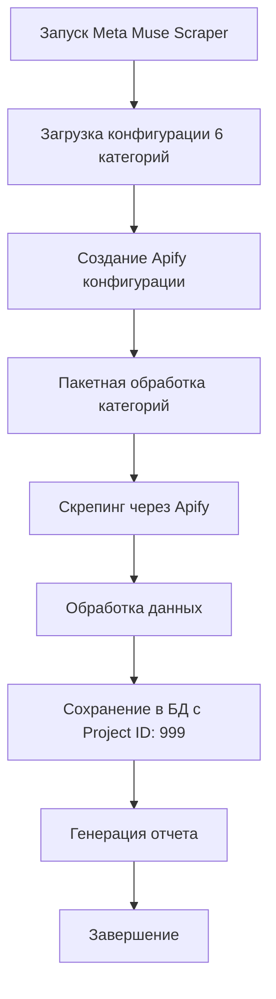

# 🛠️ Technical Implementation

## 📋 **Архитектура решения**

### Основные компоненты:

1. **MetaMuseHashtagStrategy** - Главный класс стратегии
2. **Apify Integration** - Интеграция с `apify/instagram-hashtag-scraper`
3. **Database Layer** - Работа с Neon PostgreSQL
4. **Test Suite** - Комплексное тестирование

## 🔧 **Технические детали**

### MetaMuseHashtagStrategy Class

```typescript
export class MetaMuseHashtagStrategy {
  private projectId: number = 999; // Изолированный Project ID
  private db: DatabaseAdapter;

  // Создание конфигурации 6 категорий
  createHashtagConfig(): HashtagConfig;

  // Интеграция с Apify скрепером
  createApifyConfig(hashtag: string): ApifyConfig;

  // Пакетная конфигурация
  createBatchScrapingConfig(config: HashtagConfig): BatchScrapingConfig;

  // Обработка и сохранение данных
  processScrapedData(data: any, category: string): InstagramPost;

  // Выполнение скрепинга по категориям
  async runScrapingForCategory(categoryName: string): Promise<ScrapingResult>;

  // Генерация отчета
  generateReport(): ScrapingReport;
}
```

### Apify Configuration

```typescript
{
  hashtag: string,
  maxPosts: 100,
  proxy: {
    useApifyProxy: true
  },
  resultsLimit: 100,
  onlyPostsWithLocation: false
}
```

### Database Schema

```sql
-- Используется существующая таблица instagram_posts
-- с добавлением:
-- - project_id: 999 (для изоляции)
-- - source_type: 'instagram_hashtag'
-- - category: string (название категории)
```

## 🎯 **Выбор Apify Scraper**

### Почему `apify/instagram-hashtag-scraper`?

| Критерий               | Оценка                     |
| ---------------------- | -------------------------- |
| **Специализация**      | ✅ Специально для hashtags |
| **Рейтинг**            | ✅ 90/100                  |
| **Активность**         | ✅ Регулярные обновления   |
| **Документация**       | ✅ Подробная               |
| **Производительность** | ✅ Высокая                 |

### Альтернативы (отклонены):

- `apify/instagram-scraper` - универсальный, но менее специализированный
- `apify/instagram-post-scraper` - для отдельных постов
- Самописный скрепер - больше времени на разработку

## 🔄 **Workflow процесса**



## 📊 **Структура данных**

### HashtagConfig

```typescript
interface HashtagConfig {
  categories: Array<{
    name: string;
    description: string;
    hashtags: string[];
  }>;
  totalHashtags: number;
}
```

### ScrapingResult

```typescript
interface ScrapingResult {
  category: string;
  processedHashtags: number;
  totalPosts: number;
}
```

### InstagramPost

```typescript
interface InstagramPost {
  id?: number;
  instagram_id: string;
  project_id: number; // 999 для Meta Muse
  source_type: string; // 'instagram_hashtag'
  hashtag: string;
  category: string;
  // ... другие поля
}
```

## 🔒 **Безопасность и изоляция**

- **Project ID: 999** - изолированное пространство данных для Meta Muse
- **Proxy через Apify** - защита от блокировок
- **Rate limiting** - ограничение запросов
- **Error handling** - graceful обработка ошибок

## ⚡ **Производительность**

- **Пакетная обработка** - по категориям
- **Асинхронные операции** - Promise-based
- **Ограничение запросов** - maxPosts: 100
- **Кэширование** - через Apify

## 🔧 **Конфигурация**

```typescript
// Основные параметры
const CONFIG = {
  PROJECT_ID: 999,
  MAX_POSTS_PER_HASHTAG: 100,
  APIFY_SCRAPER: "apify/instagram-hashtag-scraper",
  DATABASE: "Neon PostgreSQL",
  TOTAL_HASHTAGS: 151,
  CATEGORIES: 6,
};
```

---

> 🕉️ _Техническая реализация следует принципам чистой архитектуры, TDD и изоляции данных_
